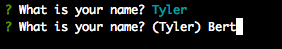
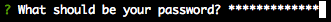
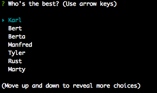
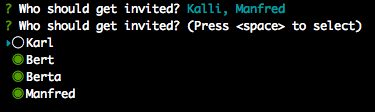
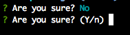

# Inquirer

A collection of common interactive command line user interfaces. A (not yet compleded) clone of the great [Inquirer.js](https://github.com/SBoudrias/Inquirer.js) and strongly inspired by the similar [inquirer.rb](https://github.com/arlimus/inquirer.rb).

Started as a fork of [inquirer.rb](https://github.com/arlimus/inquirer.rb) the changes become to fundamental to keep it that way.

## Goals

- [Inquirer.js](https://github.com/SBoudrias/Inquirer.js) API conform as possible
- Extended functionality API similar as possible
- Slim dependencies
- Easy integration

## Installation

Add this line to your application's Gemfile:

```ruby
gem 'inquirer'
```

And then execute:

    $ bundle

Or install it yourself as:

    $ gem install inquirer

## Usage

```ruby
require 'inquirer'

questions = [
  {
    name:    :user_name,
    type:    :input,  # optional - default ':input', others see below
    message: 'What is your name?',
  }
]

answers = Inquirer.prompt(questions)

p answers[:user_name]

# => Tyler
```

See the `examples` folder for more examples.

Basically it's:
- `Inquirer.prompt` takes an Array as parameter, containing question Hashes
- Each question Hash has to contain the parameters required for the given `:type` parameter
- If no `:type` paramter is given `:input` is used as default
- `Inquirer.prompt` returns a Hash with the question `:name` parameter as key and the user input as value

### Prompt types

There parameters are valid for all prompt types:

- `:message` (String) The question to print.
- `:filter` (Proc) (optional) Receive the user input and return the filtered value to be used inside the program. The value returned will be added to the answers Hash.
- `:when` (Proc|Boolean) (optional) Receive the current user answers Hash and should return true or false depending on whether or not this question should be asked. The value can also be a simple boolean.

#### Input (`type: :input`)



- `:default` (String) (optional) Default value to use if nothing is entered.
- `:validate` (Proc) (optional) Receive the user input and should return true if the value is valid, and an error message (String) otherwise. If false is returned, a default error message is provided.

#### Password (`type: :password`)



- `:default` (String) (optional) Default value to use if nothing is entered.
- `:validate` (Proc) (optional) Receive the user input and should return true if the value is valid, and an error message (String) otherwise. If false is returned, a default error message is provided.

#### List (`type: :list`)



- `:choices` (Array) Has to contain Hashes with the following parameters:
  - `:name` (String) The display value
  - `:short` (String) (optional) To display after selection
  - `:value` (String|Symbol) To save in the answers Hash
- `:default` (Integer|String|Symbol) (optional) Must be the choice index (Integer) in the Array or a choice `:value` parameters value (String|Symbol).

#### Checkbox (`type: :checkbox`)



- `:choices` (Array) Has to contain Hashes with the following parameters:
  - `:name` (String) The display value
  - `:short` (String) (optional) To display after selection
  - `:value` (String|Symbol) To save in the answers Hash
  - `:checked` (Boolean) (optional) True choices will be checked by default
- `:default` (Array) (optional) An Array of choices `:value` parameters values (String|Symbol).
- `:validate` (Proc) (optional) Receive the user input and should return true if the value is valid, and an error message (String) otherwise. If false is returned, a default error message is provided.

#### Confirm (`type: :confirm`)



- `:default` (Boolean) (optional) Default value to use if nothing is entered is expected to be a boolean.

## Development

### General

- [x] `:type` parameter (InquirerJS conform)
- [x] no `:type` parameter provided results in `:input` (InquirerJS conform)
- [x] `:name` parameter (InquirerJS conform)
- [x] `:message` (String) parameter (InquirerJS conform)
- [ ] `:message` (Proc) parameter (InquirerJS conform)
- [x] `:default` (String) parameter (optional) (InquirerJS conform)
- [ ] `:default` (Proc) parameter (optional) (InquirerJS conform)
- [x] `:when`  (Proc) parameter (optional) (InquirerJS conform)
- [x] `:when`  (Boolean) parameter (optional) (InquirerJS conform)
- [x] `:filter` (Proc) parameter (optional)
- [x] `:validate` (Proc) parameter (optional) (InquirerJS conform)
- [x] colored formatting (InquirerJS conform)
- [x] easy styling / formatting of all output components (question, result, items, password....)

### Input

- [x] Backend
- [x] `:validate` (Proc) parameter (optional) (InquirerJS conform)
- [ ] Tests

### Password

- [x] Backend
- [x] `:validate` (Proc) parameter (optional) (InquirerJS conform)
- [ ] Tests

### List

- [x] Backend
- [x] `:choices` (Array) parameter (InquirerJS conform)
- [ ] `:choices` (Proc) parameter (InquirerJS conform)
- [x] `:choices` `:name` parameter (InquirerJS conform)
- [x] `:choices` `:value` parameter (InquirerJS conform)
- [x] `:choices` `:short` parameter (InquirerJS conform)
- [x] `:validate` (Proc) parameter (optional) (InquirerJS conform)
- [ ] Tests

### Checkbox

- [x] Backend
- [x] `:choices` (Array) parameter (InquirerJS conform)
- [ ] `:choices` (Proc) parameter (InquirerJS conform)
- [x] `:choices` `:name` parameter (InquirerJS conform)
- [x] `:choices` `:value` parameter (InquirerJS conform)
- [x] `:choices` `:checked` parameter (InquirerJS conform)
- [ ] `:choices` `:disabled` (String) parameter (InquirerJS conform)
- [ ] `:choices` `:disabled` (Boolean) parameter (InquirerJS conform)
- [ ] `:choices` `:disabled` (Proc) parameter (InquirerJS conform)
- [x] `:choices` `:short` parameter
- [ ] Tests

### Confirm

- [x] Backend
- [ ] Tests

### Raw List

- [ ] Backend
- [ ] `:choices` parameter (InquirerJS conform)
- [ ] Tests

### Expand

- [ ] Backend
- [ ] `:choices` parameter (InquirerJS conform)
- [ ] Tests

### Seperator

- [ ] constructor takes a facultative String value that'll be use as the separator (InquirerJS conform)
- [ ] default separator `--------` (InquirerJS conform)
- [ ] Tests

### BottomBar

- [ ] fixed text at the bottom of a free text zone (InquirerJS conform)
- [ ] Tests

## Contributing

Bug reports and pull requests are welcome on GitHub at https://github.com/thorsteneckel/inquirer. This project is intended to be a safe, welcoming space for collaboration, and contributors are expected to adhere to the [Contributor Covenant](http://contributor-covenant.org) code of conduct.

## License

The gem is available as open source under the terms of the [MIT License](http://opensource.org/licenses/MIT).
